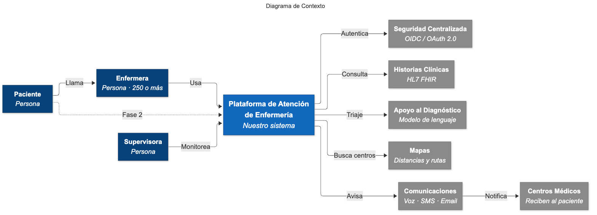
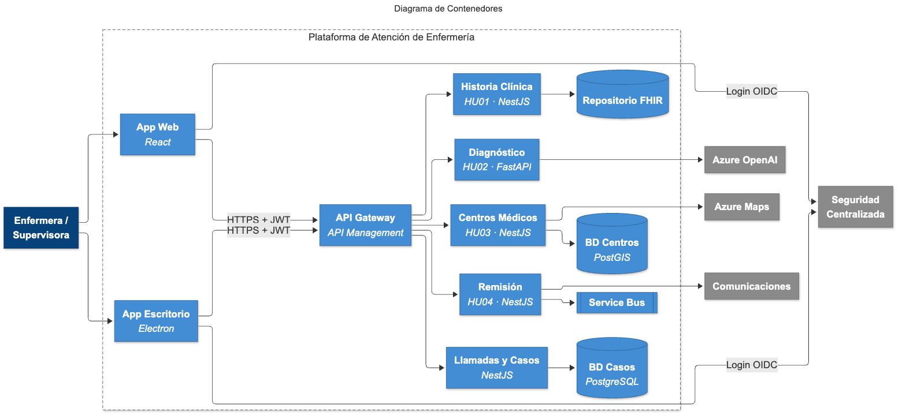
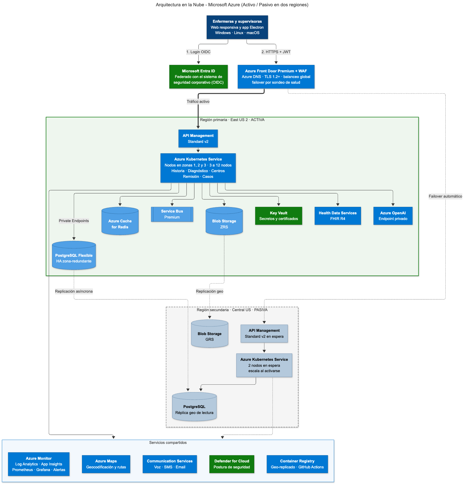
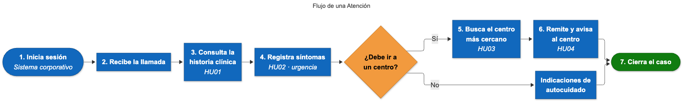

# Plataforma de Atención de Enfermería · Hospital Medical Health

Proyecto de arquitectura distribuida para el centro de llamadas de enfermería del hospital **Medical Health**: más de 250 enfermeras que atienden consultas de pacientes las 24 horas, con acceso a la historia clínica, asistencia al diagnóstico, búsqueda de centros médicos cercanos y remisión de pacientes.

La solución se documenta con el **modelo C4**, se despliega en **Microsoft Azure** con alta disponibilidad en dos regiones y se acompaña de una estimación de costos comparada con AWS.

## Entregables

| Entregable | Archivo |
|---|---|
| Documento de arquitectura | [documentacion/Documento_Arquitectura_Medical_Health.docx](documentacion/Documento_Arquitectura_Medical_Health.docx) |
| Presentación para el consejo médico | [presentacion/Presentacion_Medical_Health.pptx](presentacion/Presentacion_Medical_Health.pptx) |
| Estimación de costos (Azure vs AWS) | [costos/Estimacion_Costos_Medical_Health.xlsx](costos/Estimacion_Costos_Medical_Health.xlsx) |
| Diagramas C4 y de nube (fuente + imagen) | [diagramas/](diagramas/) |
| Guía de sustentación | [documentacion/guia-sustentacion.md](documentacion/guia-sustentacion.md) |

## Historias de usuario

| ID | Historia | Microservicio |
|---|---|---|
| HU01 | Acceder a la historia clínica del paciente | Historia Clínica + Azure Health Data Services (FHIR) |
| HU02 | Asistencia en el diagnóstico según los síntomas | Asistencia al Diagnóstico + reglas de triaje + Azure OpenAI |
| HU03 | Conocer los centros médicos más cercanos | Centros Médicos + PostgreSQL/PostGIS + Azure Maps |
| HU04 | Contactar al centro médico para avisar la llegada del paciente | Remisión y Notificación + Service Bus + Communication Services |

## Arquitectura

### Nivel 1 · Contexto


### Nivel 2 · Contenedores


### Nivel 3 · Componentes
- [Historia Clínica (HU01)](diagramas/03a-componentes-historia-clinica.png)
- [Asistencia al Diagnóstico (HU02)](diagramas/03b-componentes-diagnostico.png)
- [Centros Médicos (HU03)](diagramas/03c-componentes-centros-medicos.png)
- [Remisión y Notificación (HU04)](diagramas/03d-componentes-remision.png)

### Nivel 4 · Código
- [Clases del Servicio de Asistencia al Diagnóstico](diagramas/04-codigo-diagnostico.png)

### Arquitectura en la nube (Azure)


### Flujo de una atención


## Decisiones principales

- **Microservicios en Azure Kubernetes Service**, uno por historia de usuario, con autoescalado en tres zonas de disponibilidad.
- **Aplicación web responsiva (React) + Electron** para Windows, Linux y macOS con una sola base de código.
- **OpenID Connect / OAuth 2.0** con Microsoft Entra ID federado con el sistema de seguridad centralizado de la compañía.
- **HL7 FHIR** como estándar para las historias clínicas.
- **Activo/pasivo en dos regiones** (East US 2 y Central US) con Azure Front Door para el failover. RTO ≤ 1 hora, RPO ≤ 5 minutos.
- **Monitoreo centralizado** con Azure Monitor, Log Analytics, Application Insights, Prometheus y Grafana.

## Costos

Valores en pesos colombianos (COP) por mes.

| | Azure | AWS |
|---|---|---|
| Pago por uso | $25.934.373 | $16.763.389 |
| Con reservas a 1 año | $21.831.013 | |
| Con reservas a 3 años | $20.443.500 | |

Los precios de lista se consultaron en dólares en octubre de 2026 y se convirtieron con la TRM de **$3.273,49** (Banco de la República, vigente del 3 al 5 de octubre de 2026). El Excel tiene una hoja de **Supuestos** editable: al cambiar la TRM, el número de enfermeras, las llamadas o los nodos, todas las hojas se recalculan.

## Equipo

| Integrante | Rol |
|---|---|
| Yomaira Pardo Pajaro | Arquitecta de soluciones y líder de la presentación |
| Sebastian Aparicio | Ingeniero cloud, DevOps y seguridad |
| Liris Castillo | Analista de costos (FinOps) y documentación |

## Editar los diagramas

Los diagramas están escritos en [Mermaid](https://mermaid.js.org). Para regenerar una imagen después de editar el archivo `.mmd`:

```bash
npx @mermaid-js/mermaid-cli -i diagramas/01-contexto.mmd -o diagramas/01-contexto.png -s 2 -b white
```

También se pueden pegar en [mermaid.live](https://mermaid.live) para editarlos en el navegador.

## Estructura

```
.
├── costos/           Estimación de costos en Excel
├── diagramas/        Fuentes Mermaid (.mmd) e imágenes (.png)
├── documentacion/    Documento de arquitectura y guía de sustentación
└── presentacion/     Presentación en PowerPoint
```
